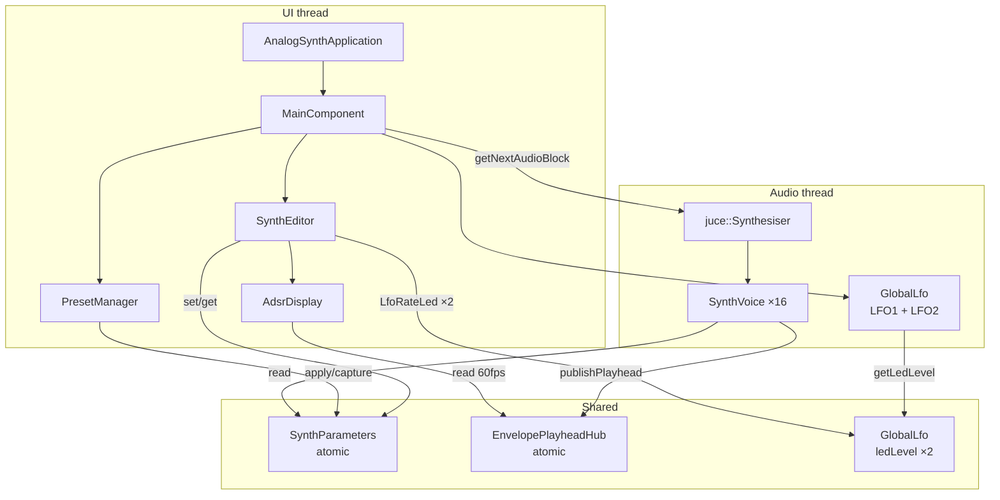
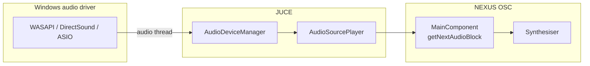
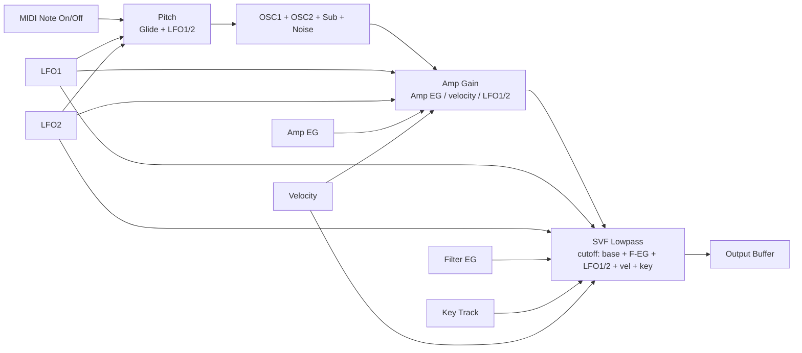

# NEXUS OSC — Architecture

**Languages:** [日本語](ARCHITECTURE.md) | [English](ARCHITECTURE.en.md)

Software structure of **NEXUS OSC**, a JUCE 8 Standalone analog-style synthesizer for Windows
(CMake project name: `AnalogSynth`).

Getting started and build steps: [README.en.md](README.en.md) ([日本語](README.md)).

---

## Overview

| Item | Details |
| ---- | ------- |
| Framework | JUCE 8.0.6 |
| Language | C++17 |
| Build | CMake + MSVC (`/utf-8`) |
| Output | Standalone EXE (`build/AnalogSynth_artefacts/Release/AnalogSynth.exe`) |
| License | MIT for this repo ([LICENSE](LICENSE)); JUCE under its own license |
| App version | `project(VERSION)` in `CMakeLists.txt` (shared by `getApplicationVersion` and EXE metadata) |
| Polyphony | 16 voices |
| Audio | Stereo out (0 in / 2 out), MIDI in; on Windows **WASAPI** is the default via JUCE |

The app runs on two paths: **UI thread** and **audio thread**. Parameters are shared through
`std::atomic` fields in `SynthParameters` for lock-free reads and writes.

---

## Layer structure

```text
┌─────────────────────────────────────────────────────────┐
│  Application Layer                                      │
│  Main.cpp — JUCEApplication / MainComponent             │
└───────────────────────────┬─────────────────────────────┘
                            │
        ┌───────────────────┼───────────────────┐
        ▼                   ▼                   ▼
┌───────────────┐   ┌───────────────┐   ┌───────────────┐
│  UI Layer     │   │  State Layer  │   │  Audio Layer  │
│  SynthEditor  │   │ SynthParameters│  │  Synthesiser  │
│  UI/*         │   │ PresetManager │   │  SynthVoice   │
│  HelpStrings  │   │ AppState      │   │  GlobalLfo    │
│               │   │ EnvelopePlay- │   │  AdsrEnvelope │
│               │   │  headHub      │   │               │
└───────────────┘   └───────────────┘   └───────────────┘
```

| Layer | Responsibility |
| ----- | -------------- |
| **Application** | Window, audio/MIDI device wiring, lifecycle |
| **UI** | Controls, user input → parameter writes |
| **State** | Parameters, presets, session JSON, playhead data for UI |
| **Audio** | Sample generation, envelopes, filter, LFO |

---

## Component relationships



---

## Entry point and main loop

### `Main.cpp`

- **`AnalogSynthApplication`** — app startup/shutdown
- **`MainComponent`** — main UI and audio
  - `juce::AudioAppComponent` — audio I/O
  - `juce::MidiInputCallback` — external MIDI

### Audio block (`getNextAudioBlock`)

1. Clear buffer
2. `GlobalLfo::prepareForBlock` — precompute LFO1/LFO2 sine per block
3. MIDI from `MidiMessageCollector`
4. Merge on-screen keyboard MIDI via `MidiKeyboardState`
5. In MONO mode, `applyMonoNoteStealing` inserts Note Offs for other notes
6. `juce::Synthesiser::renderNextBlock` — mix all voices
7. Apply master gain via `SynthParameters::getMasterLevel`

### MIDI input

- Combo box: **“All Inputs”** (all devices) or a single MIDI IN
- `MidiInput::openDevice` → `handleIncomingMidiMessage` → `midiCollector` queue

---

## Windows audio (ASIO / WASAPI)

NEXUS OSC connects to OS audio devices through **JUCE `AudioAppComponent`**.
The app does not call WASAPI/ASIO directly; JUCE **`AudioDeviceManager`** abstracts backends.

### Connection in this project

Called from the `MainComponent` constructor:

```cpp
setAudioChannels(0, 2);  // 0 in, 2 out (stereo)
```

`AudioDeviceManager::initialise` opens the **default Windows output** using the first available
device type. There is **no in-app audio settings UI** (`AudioDeviceSelectorComponent` not used).

### Callback path



1. Driver callbacks per buffer on the **audio thread**
2. `AudioSourcePlayer` calls `MainComponent::getNextAudioBlock`
3. `prepareToPlay` propagates sample rate to `SynthVoice` / `GlobalLfo`

Device/buffer persistence is **not implemented** (no XML passed to `setAudioChannels`);
each launch uses JUCE defaults.

### Output modes JUCE can use on Windows

Backends enabled at compile time in `juce_audio_devices` (default build):

| Mode | JUCE flag | This project | Example UI name | Notes |
| ---- | --------- | ------------ | ----------------- | ----- |
| **WASAPI (shared)** | `JUCE_WASAPI = 1` | **enabled, default** | `Windows Audio` | Standard API; shared device; higher latency |
| **WASAPI (exclusive)** | `JUCE_WASAPI = 1` | enabled | `Windows Audio (Exclusive Mode)` | Exclusive device; lower latency |
| **WASAPI (low latency shared)** | `JUCE_WASAPI = 1` | enabled | `Windows Audio (Low Latency Mode)` | Win10+ low-latency shared |
| **DirectSound** | `JUCE_DIRECTSOUND = 1` | enabled (fallback) | `DirectSound` | Legacy; WASAPI preferred |
| **ASIO** | `JUCE_ASIO = 0` | **disabled** | `ASIO` | Needs Steinberg ASIO SDK |

`AudioDeviceManager::createAudioDeviceTypes` order:
**WASAPI (shared → exclusive → low latency) → DirectSound → ASIO**.
The first type with a device is chosen; usually **WASAPI shared** at startup.

### When to use which (rough guide)

| Use case | Suggestion |
| -------- | ---------- |
| Casual listening | WASAPI shared (current default) |
| Lower latency on same PC | WASAPI exclusive / low-latency shared |
| Audio interface + DAW-level latency | ASIO (requires SDK) |
| Legacy / troubleshooting | DirectSound |

### Enabling ASIO (future / developers)

**ASIO is not linked in this repo.** To enable:

1. Obtain the [Steinberg ASIO SDK](https://www.steinberg.net/developers/) and accept its license
2. Add `iasiodrv.h` etc. to the include path
3. Define `JUCE_ASIO=1` in CMake / preprocessor
4. (Recommended) Add `AudioDeviceSelectorComponent` for device/buffer selection

Until then, output on Windows is via **WASAPI or DirectSound**.

### Related code

| File / API | Role |
| ---------- | ---- |
| `Main.cpp` — `setAudioChannels(0, 2)` | Output channel count |
| `Main.cpp` — `prepareToPlay` / `getNextAudioBlock` | Audio processing |
| `juce::AudioAppComponent` | Wraps `AudioDeviceManager` + `AudioSourcePlayer` |
| `juce_audio_devices` (JUCE) | WASAPI / DirectSound / ASIO implementations |

---

## Audio signal flow

### Conceptual (modules)



LFO1 and LFO2 modulating the same target are **summed**
(e.g. both Filter ON adds cutoff modulation).

### Implementation order (`SynthVoice::renderNextBlock`, per sample)

1. `GlobalLfo::valueAt` for LFO1/LFO2 (block prepared in `getNextAudioBlock`)
2. Glide frequency interpolation
3. **Amp EG** `advance` (end note if inactive)
4. **Filter EG** `advance` → `updateFilterCutoff` (base CUT, Filter EG, LFO, velocity, key track)
5. Pitch modulation when routing is ON
6. `mixOscillators` (OSC1 / OSC2 / Sub / Noise)
7. `computeAmpGain` (Amp EG × velocity) + amp LFO
8. `filter.processSample` (low-pass)
9. `publishPlayhead` at buffer end (for EG graphs)

Master gain is applied after all voices in `MainComponent::getNextAudioBlock`.

### Oscillators (`SynthVoice::mixOscillators`)

| Source | Content |
| ------ | ------- |
| OSC1 | `Waveform` (Sine / Saw / Square / Triangle) |
| OSC2 | Independent waveform + DET2 (±100 cent). Omitted from mix when `osc2Enabled` is false |
| Sub | OSC1 waveform at -1 / -2 octave |
| Noise | White noise |

Tuning: TUNE (±12 semitones), FINE (±100 cent) on MIDI note frequency.

### Filter

- `juce::dsp::StateVariableTPTFilter` (low-pass)
- Cutoff modulation: base CUT, Filter EG, LFO1/LFO2, velocity, key tracking

### Envelopes

- **`AdsrEnvelope`** — Attack / Decay / Sustain / Release (linear ADSR)
- Per-voice Amp EG and Filter EG
- Stages via `noteOn` / `noteOff` / `advance`

### Global LFO (`GlobalLfo`)

- Two stages: **LFO1 / LFO2**, each with phase, RATE, DEPTH, routing
- Shared sine across voices; `GlobalLfo::Index::Lfo1` / `Lfo2`
- `prepareForBlock` at block start; `valueAt(index, sampleIndex)` per sample
- `getLedLevel(index)` drives `LfoRateLed` at 60 fps

| Stage | Parameters (`SynthParameters`) | Defaults |
| ----- | ------------------------------ | -------- |
| LFO1 | `lfoRateHz`, `lfoDepth`, `lfoToPitch/Filter/Amp` | 4 Hz / 0.3 / Filter ON |
| LFO2 | `lfo2RateHz`, `lfo2Depth`, `lfo2ToPitch/Filter/Amp` | 0.8 Hz / 0.0 / all OFF |

Other defaults (excerpt): Cutoff **6000 Hz**, Resonance **0.707**, OSC1 **Saw**, OSC2 **Square**
(level 0), Master **0.85**, Filter ENV amount **0.5**.

---

## Parameter model (`SynthParameters`)

**Static atomic fields** (singleton-style). UI uses `set*`, audio uses `get*`.

| Category | Main parameters |
| -------- | ----------------- |
| OSC | Waveforms ×2, `osc2Enabled`, levels, TUNE/FINE, DET2 |
| MIXER | Sub / Noise, Glide, V→A / V→F |
| FILTER | Cutoff, Resonance, ENV amount, Key Track, Filter EG |
| AMP | Amp EG (A/D/S/R) |
| LFO | LFO1/LFO2: Rate, Depth, Pitch / Filter / Amp routing |
| PERF | Mono, Master |

**Rationale**: No `AudioProcessorValueTreeState`; lightweight atomics for Standalone simplicity.

---

## Voice management (`SynthVoice`)

- Extends `juce::SynthesiserVoice`
- `voiceIndex` (0–15) maps to `EnvelopePlayheadHub` slots
- **Glide**: exponential frequency slide on retrigger during active note
- **Panic**: envelope reset + playhead clear

### MONO mode

When `SynthParameters::getMonoMode()` is ON, `applyMonoModeMidi` retriggers the sounding voice
(`SynthVoice::legatoNoteOn`) on Note On. True legato (key still held) skips EG retrigger and
glides only; a Note On during **release** retriggers attack because `isKeyDown()` is false.
On Note Off, it moves to the highest held key only when that note differs from the one already
sounding. All keys up → `stopNote`.
`applyMonophonicMode` is currently an empty placeholder.

---

## UI ↔ audio visualization (`EnvelopePlayheadHub`)

Bridge for **moving dots** (playheads) on envelope graphs.

```text
Audio thread                         UI thread
SynthVoice::publishPlayhead()  →  EnvelopePlayheadHub (atomic)
                                        ↓
                                   AdsrDisplay (Timer 60fps)
```

- Per-voice Amp / Filter timeline (up to 16 points)
- `AdsrEnvelope::getTimelinePosition` matches graph time axis
- `AdsrDisplay`: separate Filter/Amp sources; static ADSR curve + up to 16 playheads (4px radius)

---

## UI architecture (`SynthEditor` + `Source/UI/`)

`MainComponent` = compact header (title + subtitle, **28px** tall) + `SynthEditor` + on-screen keyboard
(`MidiKeyboardComponent`, MIDI 36–96). Initial window **1080×680**; restores bounds from last session when available.

### Master row (top of `SynthEditor`)

| Control | Function |
| ------- | -------- |
| **ALL OFF** | Immediate silence (`onPanic` → `stopAllSound`) |
| **MONO** | Monophonic note stealing |
| **PRESET** | Preset select (built-in + user) |
| **SAVE** / **SAVE AS** | Overwrite loaded user preset / save as new (enabled after edits) |
| **LOAD** / **RESET** | Load JSON file / factory reset (INIT) |
| **DIFF** | A/B compare against baseline tone (`D` key toggles) |
| **MASTER** | Output level (**%** display, 0–1 internally) |

### Module panels

| Panel | Content |
| ----- | ------- |
| OSC | OSC1/OSC2 four waveforms each (OSC2 toggles off on re-click), TUNE/FINE/DET2 (with RESET) |
| MIXER | OSC1/OSC2/SUB/NOISE levels, Sub octave (`SubOctGroupFrame`), Glide, V-A/V-F |
| FILTER | CUT/RES/ENV/KEY, Filter EG graph + FA–FR |
| AMP | Amp EG graph + A/D/S/R |
| LFO | LFO1/LFO2 (RATE/DEPTH, PITCH/FILTER/AMP routing, RATE LED) |

### SYSTEM footer

| Control | Function |
| ------- | -------- |
| **MIDI IN** | Input device (`All Inputs` or one device) |
| Status line | MIDI status or hover help text |

### Custom UI components

| File | Role |
| ---- | ---- |
| `ModulePanel` | Module frame + `contentBounds()` |
| `FuturisticLookAndFeel` | Knob/slider look |
| `SynthTheme` | Colors, fonts, decoration helpers |
| `WaveformButton` | OSC waveform select (disables DET2 / OSC2 level when OSC2 off) |
| `SubOctGroupFrame` | Corner-bracket frame for SUB octave buttons |
| `AdsrDisplay` | ADSR curve + playheads |
| `LfoRateLed` | LFO phase LED (`GlobalLfo::Index` for LFO1/LFO2) |

### Help

- `HelpStrings.h` — Japanese help (UTF-8 literals + `juce::String::fromUTF8`)
- Hover shows text in footer status line (**14pt**, multi-line capable)

### DIFF compare mode

- Baseline captured at launch, **RESET**, and **LOAD** via `PresetManager::captureCurrentParameters()`
- **DIFF ON**: applies baseline (keeps MASTER). `SynthEditor::setParametersLocked(true)` locks UI
  - Still usable: ALL OFF / MASTER / MIDI IN / DIFF (+ on-screen keyboard / external MIDI)
- **DIFF OFF**: restores pre-toggle snapshot
- **`D`** key toggles (`MainComponent::handleDiffKeyPress`)

### OSC2 toggle

- Re-click selected OSC2 waveform → `SynthParameters::osc2Enabled = false`
- Click another waveform → set waveform + `osc2Enabled = true`
- When off: OSC2 omitted in `SynthVoice::mixOscillators`; **DET2** and MIXER **OSC2** disabled in UI

### Callbacks

`SynthEditor` reports to `MainComponent` via `std::function` (MIDI select, panic, mono, presets, DIFF, edit notifications).

Panel widths (`SynthEditor::resized`): **OSC 21% / MIXER 17% / FILTER 23% / AMP 19%**,
remainder LFO (`layoutLfo` splits LFO1 / LFO2).
MIXER/LFO labels use one full-width line; RATE LEDs sit below the RATE label.

---

## Presets (`PresetManager`)

- **Built-in (Factory)**: INIT / PAD / BASS / LEAD defined in code
- **User**: `%APPDATA%/NEXUS OSC/Presets/*.json` (`PresetManager::getUserPresetsDirectory`)
- JSON: LFO1 uses `lfoRateHz`, etc.; LFO2 uses `lfo2RateHz` / `lfo2Depth` / `lfo2To*`;
  OSC2 includes `osc2Enabled` (missing key defaults to true)
- `captureCurrentParameters` / `applyParametersFromVar` ↔ `SynthParameters`
- **Dirty detection**: compares `baselineJson` to current state (`isCurrentPresetDirty`)
  - Edited factory preset: **SAVE AS** only
  - Edited user preset: **SAVE** (overwrite) and **SAVE AS**
- After preset change / SAVE / LOAD / RESET → `markPresetBaselineFromCurrent` → UI refresh

---

## Session persistence (`AppState`)

| Item | Details |
| ---- | ------- |
| File | `%APPDATA%/NEXUS OSC/session.json` |
| Save | On quit (`MainWindow::persistSession` → `AppState::save`) |
| Contents | Full parameter JSON, preset index, MIDI IN (All Inputs / device ID), window bounds |
| Restore | `AppState::load` → `MainComponent::restoreSession` on launch |

---

## Directory layout

```text
analog_synth/
├── CMakeLists.txt          # build (includes Windows icon generation)
├── README.md
├── README.en.md
├── ARCHITECTURE.md
├── ARCHITECTURE.en.md
├── SPEC.md
├── LICENSE
├── Resources/
│   └── Icons/
│       ├── app_icon.png        # icon source (Nex on yellow-green)
│       ├── AppPrimaryIcon.rc   # exe resource ID 1
│       └── generate_app_icon.py
├── docs/
│   └── images/
│       ├── nexus-osc-ui.png
│       └── playing.png
└── Source/
    ├── Main.cpp            # app / audio / MIDI / DIFF
    ├── AppState.*          # session JSON
    ├── SynthEditor.*
    ├── SynthVoice.*
    ├── SynthSound.*
    ├── SynthParameters.h
    ├── AdsrEnvelope.h
    ├── GlobalLfo.h
    ├── EnvelopePlayhead.*
    ├── PresetManager.*
    ├── Waveform.h
    ├── HelpStrings.h
    └── UI/
        ├── AdsrDisplay.*
        ├── LfoRateLed.*
        ├── ModulePanel.*
        ├── WaveformButton.*
        ├── SubOctGroupFrame.h
        ├── FuturisticLookAndFeel.*
        └── SynthTheme.h
```

---

## Thread safety

| Data | Mechanism |
| ---- | --------- |
| Synth parameters | `std::atomic` + `memory_order_relaxed` |
| Playhead positions | atomics inside `EnvelopePlayheadHub` |
| LFO LED levels | `GlobalLfo::State::ledLevel` (per LFO, atomic) |
| MIDI | `MidiMessageCollector` (JUCE thread-safe queue) |

The UI does not touch audio objects directly; only atomic parameter writes.

---

## Build and dependencies

```cmake
FetchContent → JUCE 8.0.6
juce_add_gui_app(AnalogSynth)
# Windows: app_icon.png → icon.ico (at build time) + AppPrimaryIcon.rc (resource ID 1)
target_sources → Main, AppState, SynthEditor, PresetManager, SynthVoice,
                 EnvelopePlayhead, SynthSound, UI/* (6 files + AppPrimaryIcon.rc)
target_link_libraries → juce_audio_utils, juce_dsp
```

MSVC: `/utf-8` for UTF-8 source.

### Windows application icon

Explorer uses **resource ID 1** for the `.exe` file icon. JUCE’s default `IDI_ICON1` string
name alone may not show in Explorer, so we embed `AppPrimaryIcon.rc` explicitly.

| File | Role |
| ---- | ---- |
| `Resources/Icons/app_icon.png` | 512×512 source (yellow-green `#adff2f` + black **Nex**) |
| `Resources/Icons/generate_app_icon.py` | Regenerate PNG |
| `Resources/Icons/AppPrimaryIcon.rc` | `1 ICON DISCARDABLE "icon.ico"` |
| Build output `icon.ico` | Generated by `juceaide winicon` from PNG (16/32/48/256 px) |

---

## Current limitations and future work

**Standalone only** for now. Not implemented or planned:

| Area | Content |
| ---- | ------- |
| Plugin | VST3 / CLAP (`AudioProcessor` migration) |
| FX | Chorus / delay / reverb |
| Performance | Pitch bend, mod wheel |
| DSP | **SmoothedValue** (smooth knob targets; atomics today), effective cutoff Hz display |
| Other | Arpeggiator, MPE, voice-count display |
| Audio UI | Device/buffer picker (`AudioDeviceSelectorComponent`) |

A natural plugin path: move audio/MIDI from `MainComponent` to `juce::AudioProcessor` and
replace `SynthParameters` with `APVTS` or an equivalent parameter bus.

---

## File quick reference

| Task | Files |
| ---- | ----- |
| Sound / DSP | `SynthVoice.cpp`, `AdsrEnvelope.h`, `Waveform.h`, `GlobalLfo.h` |
| LFO changes | `GlobalLfo.h`, `SynthParameters.h`, `SynthEditor.cpp` |
| New parameters | `SynthParameters.h`, `SynthEditor.cpp`, `PresetManager.cpp` |
| UI layout | `SynthEditor.cpp` (`layout*`) |
| Theme / look | `UI/SynthTheme.h`, `FuturisticLookAndFeel.*` |
| EG graphs | `UI/AdsrDisplay.*`, `EnvelopePlayhead.*` |
| Preset format / dirty state | `PresetManager.cpp` |
| Session JSON | `AppState.cpp` |
| DIFF / baseline | `Main.cpp` |
| OSC2 toggle | `SynthEditor.cpp`, `SynthParameters.h`, `SynthVoice.cpp` |
| MIDI / audio I/O | `Main.cpp`, `AudioAppComponent` / `AudioDeviceManager` |
| Windows icon | `CMakeLists.txt`, `Resources/Icons/*` |
