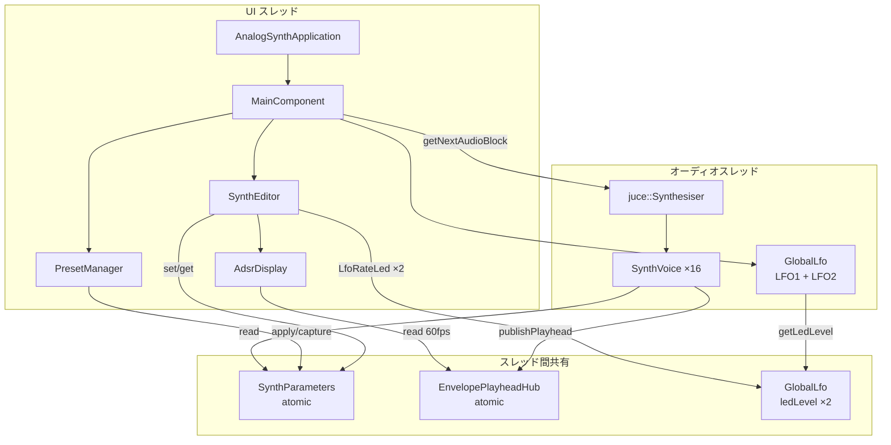
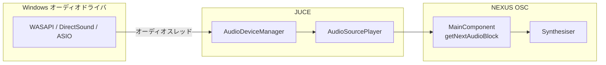
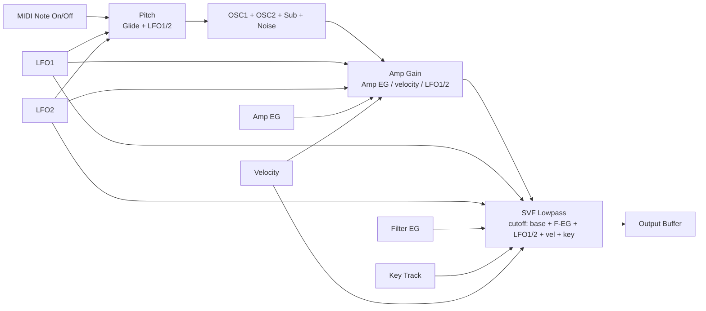

# NEXUS OSC — アーキテクチャ

**Languages:** [日本語](ARCHITECTURE.md) | [English](ARCHITECTURE.en.md)

Windows 向け JUCE 8 Standalone アナログ系シンセサイザー **NEXUS OSC**（CMake プロジェクト名: `AnalogSynth`）のソフトウェア構成を説明する。

入門・ビルド手順は [README.md](README.md)（[English](README.en.md)）を参照。

---

## 概要

| 項目      | 内容                                                                              |
| ------- | ------------------------------------------------------------------------------- |
| フレームワーク | JUCE 8.0.6                                                                      |
| 言語      | C++17                                                                           |
| ビルド     | CMake + MSVC（`/utf-8`）                                                          |
| 出力      | Standalone EXE（`build/AnalogSynth_artefacts/Release/AnalogSynth.exe`）           |
| ライセンス   | 本リポジトリ MIT（[LICENSE](LICENSE)）、JUCE は別ライセンス                                     |
| アプリ版    | `CMakeLists.txt` の `project(VERSION)`（`getApplicationVersion` / EXE メタデータと共通） |
| ポリフォニー  | 16 ボイス                                                                          |
| オーディオ   | ステレオ出力（0 in / 2 out）、MIDI 入力対応。Windows では JUCE 経由で **WASAPI** がデフォルト            |

アプリは **UI スレッド** と **オーディオスレッド** の 2 系統で動作する。パラメータは `SynthParameters` の `std::atomic` 経由でスレッド間共有し、ロックフリーで読み書きする。

---

## レイヤ構成

```text
┌─────────────────────────────────────────────────────────┐
│  Application Layer                                      │
│  Main.cpp — JUCEApplication / MainComponent             │
└───────────────────────────┬─────────────────────────────┘
                            │
        ┌───────────────────┼───────────────────┐
        ▼                   ▼                   ▼
┌───────────────┐   ┌───────────────┐   ┌───────────────┐
│  UI Layer     │   │  State Layer  │   │  Audio Layer  │
│  SynthEditor  │   │ SynthParameters│  │  Synthesiser  │
│  UI/*         │   │ PresetManager │   │  SynthVoice   │
│  HelpStrings  │   │ AppState      │   │  GlobalLfo    │
│               │   │ EnvelopePlay- │   │  AdsrEnvelope │
│               │   │  headHub      │   │               │
└───────────────┘   └───────────────┘   └───────────────┘
```

| レイヤ             | 責務                              |
| --------------- | ------------------------------- |
| **Application** | ウィンドウ、オーディオ/MIDI デバイス接続、ライフサイクル |
| **UI**          | コントロール表示、ユーザー操作 → パラメータ書き込み     |
| **State**       | パラメータ保持、プリセット入出力、セッション JSON、UI 可視化用の再生ヘッド  |
| **Audio**       | サンプル生成、エンベロープ、フィルター、LFO         |

---

## コンポーネント関係



---

## エントリポイントとメインループ

### `Main.cpp`

- `**AnalogSynthApplication**` — JUCE アプリの起動・終了
- `**MainComponent**` — 実体の UI とオーディオ処理
  - `juce::AudioAppComponent` — オーディオ I/O
  - `juce::MidiInputCallback` — 外部 MIDI 受信

### オーディオブロック処理（`getNextAudioBlock`）

1. バッファクリア
2. `GlobalLfo::prepareForBlock` — LFO1 / LFO2 のサイン波をブロック単位で事前計算
3. `MidiMessageCollector` から MIDI を取得
4. `MidiKeyboardState` で仮想キーボード MIDI をマージ
5. MONO モード時は `applyMonoNoteStealing` で他ノート OFF を挿入
6. `juce::Synthesiser::renderNextBlock` — 全ボイス合成
7. `SynthParameters::getMasterLevel` でマスターゲイン適用

### MIDI 入力

- コンボボックスで **「All Inputs」**（全デバイス）または個別 MIDI IN を選択
- `MidiInput::openDevice` → `handleIncomingMidiMessage` → `midiCollector` キュー

---

## Windows 音声出力（ASIO / WASAPI）

NEXUS OSC は **JUCE の `AudioAppComponent`** 経由で OS のオーディオデバイスに接続する。
アプリ側で WASAPI や ASIO を直接呼ぶのではなく、JUCE の `**AudioDeviceManager**` がバックエンドを抽象化する。

### 本プロジェクトでの接続方法

`MainComponent` コンストラクタで次を呼び出す。

```cpp
setAudioChannels(0, 2);  // 入力 0ch、出力 2ch（ステレオ）
```

内部では `AudioDeviceManager::initialise` が走り、利用可能な最初のデバイスタイプで
**Windows のデフォルト出力デバイス** が開かれる。
現状、**アプリ内にオーディオ設定 UI はない**（`AudioDeviceSelectorComponent` 未使用）。

### コールバック経路



1. ドライバがバッファごとに **オーディオスレッド** でコールバック
2. `AudioSourcePlayer` が `MainComponent::getNextAudioBlock` を呼ぶ
3. `prepareToPlay` でサンプルレートが `SynthVoice` / `GlobalLfo` に伝播

設定の永続化（前回使ったデバイス名・バッファサイズ等）は、現状 `setAudioChannels` に XML を渡していないため **行っていない**。起動のたびに JUCE のデフォルト選択に依存する。

### JUCE が Windows で使える出力方式

JUCE 8 の `juce_audio_devices` モジュールがコンパイル時に有効化するバックエンド（本プロジェクトのデフォルトビルド）:

| 方式                   | JUCE 設定                | 本プロジェクト      | UI 上の名称（例）                         | 概要                                               |
| -------------------- | ---------------------- | ------------ | ---------------------------------- | ------------------------------------------------ |
| **WASAPI（共有）**       | `JUCE_WASAPI = 1`      | **有効・デフォルト** | `Windows Audio`                    | Windows Vista 以降の標準 API。他アプリとデバイスを共有。レイテンシはやや大きめ |
| **WASAPI（排他）**       | `JUCE_WASAPI = 1`      | 有効           | `Windows Audio (Exclusive Mode)`   | デバイスを独占。共有モードより低レイテンシ・固定サンプルレート向き                |
| **WASAPI（低レイテンシ共有）** | `JUCE_WASAPI = 1`      | 有効           | `Windows Audio (Low Latency Mode)` | Win10 以降の低レイテンシ共有モード                             |
| **DirectSound**      | `JUCE_DIRECTSOUND = 1` | 有効（フォールバック）  | `DirectSound`                      | レガシー API。互換用。通常は WASAPI を優先                      |
| **ASIO**             | `JUCE_ASIO = 0`        | **無効（未リンク）** | `ASIO`                             | Steinberg ASIO SDK が必要。DAW 向け低レイテンシ              |

`AudioDeviceManager::createAudioDeviceTypes` の登録順は
**WASAPI（共有 → 排他 → 低レイテンシ）→ DirectSound → ASIO**。
デバイスを持つ最初のタイプが選ばれるため、通常は **WASAPI 共有** が起動時に使われる。

### 各方式の使い分け（目安）

| 用途                      | 推奨                   |
| ----------------------- | -------------------- |
| 手軽に音を出す・一般リスニング         | WASAPI 共有（現状のデフォルト）  |
| レイテンシを下げたい（同一 PC）       | WASAPI 排他 / 低レイテンシ共有 |
| オーディオ IF + DAW 級の低レイテンシ | ASIO（要 SDK 有効化）      |
| 古い環境・トラブル時              | DirectSound          |

### ASIO を有効にする場合（将来・開発者向け）

本リポジトリでは **ASIO はビルドに含まれていない**。有効化するには:

1. [Steinberg ASIO SDK](https://www.steinberg.net/developers/) を入手し、ライセンスに同意
2. `iasiodrv.h` 等をヘッダ検索パスに追加
3. CMake / プリプロセッサで `JUCE_ASIO=1` を定義
4. （推奨）`AudioDeviceSelectorComponent` 等でデバイス・バッファサイズを選べる UI を追加

ASIO 有効化までは、Windows 上の実出力は **WASAPI または DirectSound** 経由となる。

### 関連コード

| ファイル / API                                         | 役割                                              |
| -------------------------------------------------- | ----------------------------------------------- |
| `Main.cpp` — `setAudioChannels(0, 2)`              | 出力チャンネル数の指定                                     |
| `Main.cpp` — `prepareToPlay` / `getNextAudioBlock` | オーディオ処理本体                                       |
| `juce::AudioAppComponent`                          | `AudioDeviceManager` + `AudioSourcePlayer` のラッパ |
| `juce_audio_devices`（JUCE）                         | WASAPI / DirectSound / ASIO 実装                  |

---

## オーディオ信号フロー

### 概念図（モジュール単位）



同一宛先への LFO1 / LFO2 の変調は **加算**（例: 両方 Filter ON ならカットオフ変調が合算）。

### 実装順（`SynthVoice::renderNextBlock`・サンプルごと）

1. `GlobalLfo::valueAt` で LFO1 / LFO2 の値を取得（ブロックは `MainComponent::getNextAudioBlock` 先頭で `prepareForBlock` 済み）
2. Glide による周波数補間
3. **Amp EG** を `advance`（非アクティブならノート終了）
4. **Filter EG** を `advance` → `updateFilterCutoff`（ベース CUT、Filter EG、LFO、ベロシティ、キートラッキング）
5. LFO によるピッチ変調（対象が ON のとき）
6. `mixOscillators`（OSC1 / OSC2 / Sub / Noise）
7. `computeAmpGain`（Amp EG × ベロシティ）＋ LFO によるアンプ変調
8. `filter.processSample`（ローパス）
9. バッファ末尾で `publishPlayhead`（EG グラフ用）

マスターゲインは全ボイス合成後、`MainComponent::getNextAudioBlock` で `SynthParameters::getMasterLevel` を適用する。

### オシレーター（`SynthVoice::mixOscillators`）

| ソース   | 内容                                            |
| ----- | --------------------------------------------- |
| OSC1  | `Waveform` 選択（Sine / Saw / Square / Triangle） |
| OSC2  | 独立波形 + DET2（±100 cent）。`osc2Enabled` が false のときミックスから除外 |
| Sub   | OSC1 波形を -1 / -2 オクターブ                        |
| Noise | ホワイトノイズ                                       |

チューニング: TUNE（±12 sem）、FINE（±100 cent）を MIDI ノート周波数に適用。

### フィルター

- `juce::dsp::StateVariableTPTFilter`（ローパス）
- カットオフ変調: ベース CUT、Filter EG、LFO1 / LFO2、ベロシティ、キートラッキング

### エンベロープ

- `**AdsrEnvelope`** — Attack / Decay / Sustain / Release（線形 ADSR）
- Amp EG と Filter EG を各ボイスが独立保持
- `noteOn` / `noteOff` / `advance` で段階遷移

### グローバル LFO（`GlobalLfo`）

- **LFO1 / LFO2** の 2 段構成。各段は独立した位相・RATE・DEPTH・ルーティング
- 全ボイス共通のサイン波。`GlobalLfo::Index::Lfo1` / `Lfo2` で参照
- ブロック先頭で `prepareForBlock` し、`valueAt(index, sampleIndex)` でサンプル参照
- `getLedLevel(index)` を UI の `LfoRateLed`（各 LFO 用 1 個）が 60fps で表示

| 段    | パラメータ（`SynthParameters`）                            | デフォルト                  |
| ---- | --------------------------------------------------- | ---------------------- |
| LFO1 | `lfoRateHz`, `lfoDepth`, `lfoToPitch/Filter/Amp`    | 4 Hz / 0.3 / Filter ON |
| LFO2 | `lfo2RateHz`, `lfo2Depth`, `lfo2ToPitch/Filter/Amp` | 0.8 Hz / 0.0 / すべて OFF |

その他の初期値（抜粋）: Cutoff **6000 Hz**、Resonance **0.707**、OSC1 **Saw**、OSC2 **Square**（レベル 0）、Master **0.85**、Filter ENV 量 **0.5**。

---

## パラメータモデル（`SynthParameters`）

シングルトン的な **static atomic 変数群**。UI から `set`*、オーディオから `get*` でアクセス。

| カテゴリ   | 主なパラメータ                                                |
| ------ | ------------------------------------------------------ |
| OSC    | 波形 ×2、`osc2Enabled`、レベル、TUNE/FINE、DET2               |
| MIXER  | Sub / Noise、Glide、V→A / V→F                            |
| FILTER | Cutoff、Resonance、ENV 量、Key Track、Filter EG             |
| AMP    | Amp EG（A/D/S/R）                                        |
| LFO    | LFO1 / LFO2 各段: Rate、Depth、Pitch / Filter / Amp ルーティング |
| PERF   | Mono、Master                                            |

**設計意図**: JUCE の `AudioProcessorValueTreeState` を使わず、軽量な atomic 共有で Standalone 向けに単純化している。

---

## ボイス管理（`SynthVoice`）

- `juce::SynthesiserVoice` を継承
- コンストラクタで `voiceIndex`（0〜15）を受け取り、`EnvelopePlayheadHub` のスロットと対応
- **Glide**: 既存ノート中の再トリガー時、指数補間で周波数をスライド
- **Panic**: エンベロープ即リセット + 再生ヘッドクリア

### MONO モード

`SynthParameters::getMonoMode()` が ON のとき、`applyMonoModeMidi` が Note On を
**鳴っているボイスへ再トリガー**（`SynthVoice::legatoNoteOn`）する。
鍵を離さず別キーを押した **レガート** は EG を再立ち上げせず GLIDE のみ。
**リリース中**に新しい Note On が来た場合は `isKeyDown()` が false のため EG を再トリガーする。
Note Off 時は他キーが押されていればその最高音へ遷移するが、**すでにその音を鳴らしている
場合は何もしない**。全キー離しで `stopNote`。
`applyMonophonicMode` は現状プレースホルダ（空実装）。

---

## UI ↔ オーディオ可視化（`EnvelopePlayheadHub`）

エンベロープグラフ上の **移動する点**（再生ヘッド）用ブリッジ。

```text
オーディオスレッド                    UI スレッド
SynthVoice::publishPlayhead()  →  EnvelopePlayheadHub（atomic）
                                        ↓
                                   AdsrDisplay（Timer 60fps）
```

- ボイスごとに Amp / Filter の timeline 位置を保持（最大 16 点）
- `AdsrEnvelope::getTimelinePosition` がグラフ描画と同じ時間軸を算出
- `AdsrDisplay` は Filter / Amp 用に `PlayheadSource` を分け、静的 ADSR 曲線 + 最大 16 個の再生ヘッド（半径 4px）を描画

---

## UI アーキテクチャ（`SynthEditor` + `Source/UI/`）

`MainComponent` はコンパクトヘッダー（タイトル + サブタイトル、高さ **28px**）＋ `SynthEditor` ＋ 仮想キーボード（`MidiKeyboardComponent`、MIDI 36〜96）で構成。ウィンドウ初期サイズは **1080×680**（前回終了時の位置・サイズがあれば復元）。

### マスター行（`SynthEditor` 上部）

| コントロール                           | 内容                                   |
| -------------------------------- | ------------------------------------ |
| **ALL OFF**                      | 全ボイス即時停止（`onPanic` → `stopAllSound`） |
| **MONO**                         | モノフォニック（ノートスティーリング）                  |
| **PRESET**                       | プリセット選択（内蔵 + ユーザー）                    |
| **SAVE** / **SAVE AS**           | ユーザープリセット上書き / 別名保存（編集時のみ有効）        |
| **LOAD** / **RESET**             | JSON ファイル読込 / INIT 相当へ復帰              |
| **DIFF**                         | 基準音色との A/B 比較（`D` キーでも切替）             |
| **MASTER**                       | 出力レベル（**%** 表示、内部 0〜1）                |

### モジュールパネル

| パネル    | 内容                                                         |
| ------ | ---------------------------------------------------------- |
| OSC    | OSC1 / OSC2 各 4 波形（OSC2 は同波形再クリックで OFF）、TUNE / FINE / DET2（RESET 付き） |
| MIXER  | OSC1 / OSC2 / SUB / NOISE レベル、Sub オクターブ（`SubOctGroupFrame`）、Glide、V-A / V-F    |
| FILTER | CUT / RES / ENV / KEY、Filter EG グラフ + FA〜FR                |
| AMP    | Amp EG グラフ + A / D / S / R                                 |
| LFO    | LFO1 / LFO2（各 RATE/DEPTH、PITCH/FILTER/AMP ルーティング、RATE LED） |

### SYSTEM フッター

| コントロール      | 内容                               |
| ----------- | -------------------------------- |
| **MIDI IN** | 入力デバイス選択（`All Inputs` または個別）     |
| ステータス行      | MIDI 接続表示、またはコントロール hover 時のヘルプ文 |

### カスタム UI コンポーネント

| ファイル                    | 役割                                             |
| ----------------------- | ---------------------------------------------- |
| `ModulePanel`           | モジュール枠 + `contentBounds()`                     |
| `FuturisticLookAndFeel` | ノブ・スライダーの外観                                    |
| `SynthTheme`            | 色・フォント・装飾ユーティリティ                               |
| `WaveformButton`        | OSC 波形選択（OSC2 OFF 時は DET2 / OSC2 レベルを非活性化）       |
| `SubOctGroupFrame`      | SUB オクターブボタン用角括弧フレーム                           |
| `AdsrDisplay`           | ADSR 曲線 + 再生ヘッド                                |
| `LfoRateLed`            | LFO 位相 LED（`GlobalLfo::Index` で LFO1/LFO2 を指定） |

### ヘルプ

- `HelpStrings.h` — 日本語ヘルプ（UTF-8 リテラル + `juce::String::fromUTF8`）
- コントロール hover でフッターステータス行に説明表示（**14pt**、複数行対応）

### DIFF 比較モード

- 起動時・**RESET**・**LOAD** 後に `PresetManager::captureCurrentParameters()` で基準を保存
- **DIFF ON**: 基準パラメータを適用（MASTER は維持）。`SynthEditor::setParametersLocked(true)` で UI ロック
  - 操作可: ALL OFF / MASTER / MIDI IN / DIFF（＋仮想キーボード・外部 MIDI 演奏）
- **DIFF OFF**: トグル前のスナップショットへ復帰
- キーボード **`D`** でトグル（`MainComponent::handleDiffKeyPress`）

### OSC2 トグル

- 選択中の OSC2 波形ボタンを再クリック → `SynthParameters::osc2Enabled = false`
- 別波形クリック → 波形設定 + `osc2Enabled = true`
- OFF 時: `SynthVoice::mixOscillators` で OSC2 を除外、`DET2` / MIXER **OSC2** を UI 非活性化

### コールバック

`SynthEditor` は `std::function` で `MainComponent` にイベントを返す（MIDI 選択、Panic、Mono、プリセット操作、DIFF、編集通知）。

モジュール幅（`SynthEditor::resized`）: **OSC 21% / MIXER 17% / FILTER 23% / AMP 19%**、残りを LFO
（`layoutLfo` で LFO1 / LFO2 の 2 列）。
MIXER / LFO のラベルは列幅いっぱいの 1 行にまとめ、RATE の LED はラベル直下に配置する。

---

## プリセット（`PresetManager`）

- **内蔵プリセット（Factory）**: INIT / PAD / BASS / LEAD をコード内定義
- **User**: `%APPDATA%/NEXUS OSC/Presets/*.json` に保存（`PresetManager::getUserPresetsDirectory`）
- JSON キー: LFO1 は `lfoRateHz` 等、LFO2 は `lfo2RateHz` / `lfo2Depth` / `lfo2To`*、OSC2 は `osc2Enabled`（旧プリセットは true 扱い）
- `captureCurrentParameters` / `applyParametersFromVar` で `SynthParameters` と JSON を相互変換
- **dirty 判定**: `baselineJson` と現在値を比較（`isCurrentPresetDirty`）
  - 内蔵プリセット編集時: **SAVE AS** のみ有効
  - ユーザープリセット編集時: **SAVE**（上書き）と **SAVE AS** が有効
- プリセット変更・SAVE / LOAD / RESET 後 → `markPresetBaselineFromCurrent` → UI 更新

---

## セッション永続化（`AppState`）

| 項目 | 内容 |
| ---- | ---- |
| ファイル | `%APPDATA%/NEXUS OSC/session.json` |
| 保存 | 終了時（`MainWindow::persistSession` → `AppState::save`） |
| 内容 | 全パラメータ JSON、プリセットインデックス、MIDI IN（All Inputs / デバイス ID）、ウィンドウ bounds |
| 復元 | 起動時 `AppState::load` → `MainComponent::restoreSession` |

---

## ディレクトリ構成

```text
analog_synth/
├── CMakeLists.txt          # ビルド定義（Windows アイコン生成含む）
├── README.md               # 入門・ビルド・使い方（日本語）
├── README.en.md            # Getting started（English）
├── ARCHITECTURE.md         # 本ドキュメント（日本語）
├── ARCHITECTURE.en.md      # Architecture（English）
├── SPEC.md                 # UI 機能仕様
├── LICENSE                 # MIT
├── Resources/
│   └── Icons/
│       ├── app_icon.png        # アイコン元画像（Nex / 黄緑）
│       ├── AppPrimaryIcon.rc   # exe リソース ID 1
│       └── generate_app_icon.py
├── docs/
│   └── images/
│       ├── nexus-osc-ui.png  # メイン画面（README）
│       └── playing.png       # 演奏時（README）
└── Source/
    ├── Main.cpp            # アプリ / オーディオ / MIDI ハブ / DIFF
    ├── AppState.*          # セッション JSON
    ├── SynthEditor.*       # メイン UI
    ├── SynthVoice.*        # 1 ボイスの DSP
    ├── SynthSound.*        # Synthesiser 用サウンド判定
    ├── SynthParameters.h   # グローバルパラメータ（atomic）
    ├── AdsrEnvelope.h      # ADSR エンベロープ
    ├── GlobalLfo.h         # グローバル LFO
    ├── EnvelopePlayhead.*  # EG グラフ再生ヘッド
    ├── PresetManager.*     # プリセット管理
    ├── Waveform.h          # 波形 enum + サンプル生成
    ├── HelpStrings.h       # 日本語ヘルプ
    └── UI/
        ├── AdsrDisplay.*
        ├── LfoRateLed.*
        ├── ModulePanel.*
        ├── WaveformButton.*
        ├── SubOctGroupFrame.h
        ├── FuturisticLookAndFeel.*
        └── SynthTheme.h
```

---

## スレッド安全性

| データ         | 方式                                                  |
| ----------- | --------------------------------------------------- |
| シンセパラメータ    | `std::atomic` + `memory_order_relaxed`              |
| 再生ヘッド位置     | `EnvelopePlayheadHub` 内 atomic                      |
| LFO LED レベル | `GlobalLfo` 内 `State::ledLevel`（LFO1/LFO2 各 atomic） |
| MIDI        | `MidiMessageCollector`（JUCE スレッドセーフキュー）             |

UI からオーディオオブジェクトを直接触らない。パラメータ変更は atomic 書き込みのみ。

---

## ビルドと依存

```cmake
FetchContent → JUCE 8.0.6
juce_add_gui_app(AnalogSynth)
# Windows: app_icon.png → icon.ico（ビルド時）+ AppPrimaryIcon.rc（リソース ID 1）
target_sources → Main, AppState, SynthEditor, PresetManager, SynthVoice,
                 EnvelopePlayhead, SynthSound, UI/*（6 ファイル + AppPrimaryIcon.rc）
target_link_libraries → juce_audio_utils, juce_dsp
```

MSVC ではソース UTF-8 対応のため `/utf-8` を付与。

### Windows アプリケーションアイコン

Explorer が参照する **リソース ID 1** のアイコンを明示的に埋め込む（JUCE 既定の `IDI_ICON1` 文字列名だけでは Explorer に反映されない場合がある）。

| ファイル | 役割 |
| -------- | ---- |
| `Resources/Icons/app_icon.png` | 512×512 ソース（黄緑 `#adff2f` + 黒字 **Nex**） |
| `Resources/Icons/generate_app_icon.py` | PNG 再生成スクリプト |
| `Resources/Icons/AppPrimaryIcon.rc` | `1 ICON DISCARDABLE "icon.ico"` |
| ビルド生成 `icon.ico` | `juceaide winicon` が `app_icon.png` から生成（16/32/48/256px） |

---

## 現状の制約と今後の拡張

現時点では **Standalone のみ**。以下は未実装または将来候補。

| 領域       | 内容                                                                                                      |
| -------- | ------------------------------------------------------------------------------------------------------- |
| プラグイン    | VST3 / CLAP 化（`AudioProcessor` への移行）                                                                    |
| FX       | コーラス / ディレイ / リバーブ                                                                                      |
| 演奏       | ピッチベンド、Mod ホイール                                                                                         |
| DSP      | **SmoothedValue**（JUCE: ノブの目標値へ短時間でなめらかに追従し、Cutoff 等の急変によるクリック/ザラつきを抑える。現状は atomic 直読み）、実効 Cutoff Hz 表示 |
| その他      | アルペジエータ、MPE、ポリフォニー表示                                                                                    |
| オーディオ UI | デバイス選択・バッファサイズ設定（`AudioDeviceSelectorComponent`）                                                        |

プラグイン化する場合は `MainComponent` のオーディオ/MIDI 処理を `juce::AudioProcessor` に移し、`SynthParameters` を `APVTS` または同等のパラメータバスに置き換えるのが自然な移行経路となる。

---

## 関連ファイル早見表

| やりたいこと           | 触るファイル                                                            |
| ---------------- | ----------------------------------------------------------------- |
| 音色・DSP 変更        | `SynthVoice.cpp`, `AdsrEnvelope.h`, `Waveform.h`, `GlobalLfo.h`   |
| LFO 追加・変更        | `GlobalLfo.h`, `SynthParameters.h`, `SynthEditor.cpp`             |
| パラメータ追加          | `SynthParameters.h`, `SynthEditor.cpp`, `PresetManager.cpp`       |
| UI レイアウト         | `SynthEditor.cpp`（`layout`*）                                      |
| テーマ・見た目          | `UI/SynthTheme.h`, `FuturisticLookAndFeel.*`                      |
| EG グラフ           | `UI/AdsrDisplay.*`, `EnvelopePlayhead.*`                          |
| プリセット形式 / dirty 判定 | `PresetManager.cpp`                                               |
| セッション JSON          | `AppState.cpp`                                                    |
| DIFF / 比較基準          | `Main.cpp`（`captureDiffBaseline`, `enterDiffMode`）               |
| OSC2 トグル            | `SynthEditor.cpp`, `SynthParameters.h`, `SynthVoice.cpp`        |
| MIDI / オーディオ I/O | `Main.cpp`（MIDI）、`AudioAppComponent` / `AudioDeviceManager`（出力方式） |
| Windows アイコン        | `CMakeLists.txt`, `Resources/Icons/*`                             |
