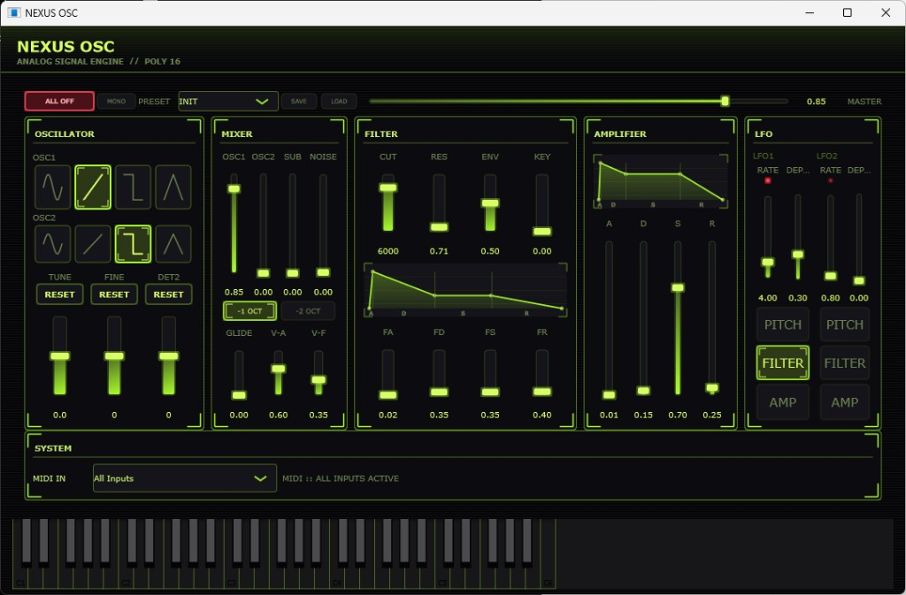
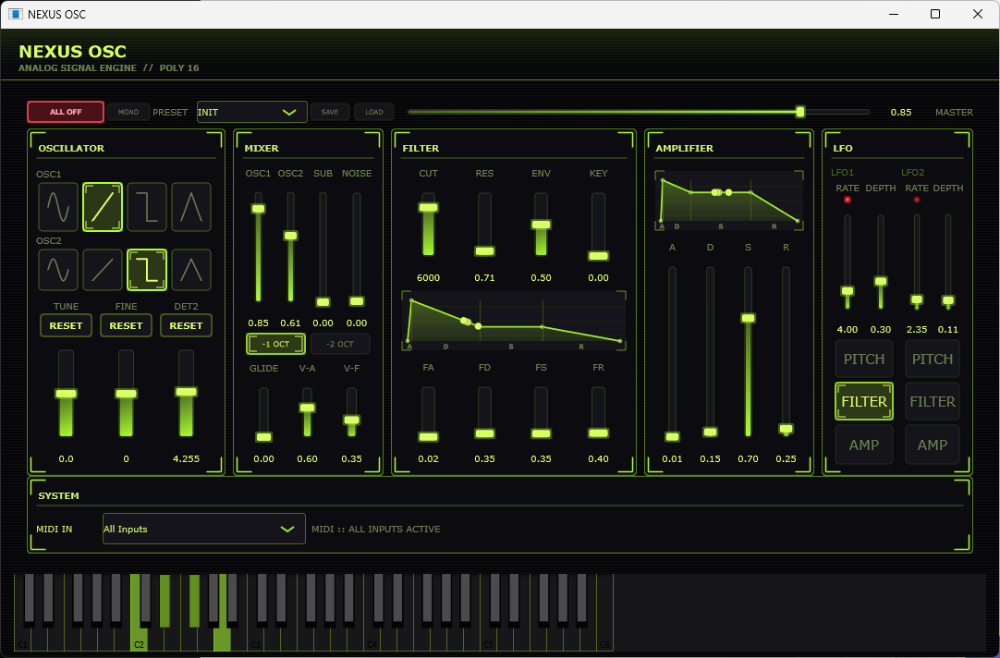

# NEXUS OSC

**Languages:** [日本語](README.md) | [English](README.en.md)

[License: MIT](https://opensource.org/licenses/MIT)

Windows 向けのアナログ系シンセサイザー（Standalone）。USB MIDI キーボードで演奏でき、内蔵の仮想キーボードでも試せます。

## スクリーンショット

### 実行画面



画面サイズ: 1080×680

上部: プリセット・MONO・ALL OFF・MASTER

中央: シンセモジュール

下部: 仮想キーボードと MIDI 設定

### 演奏時



仮想キーボードで押下中のキーが点灯

EG のグラフ上の再生位置に点を表示

FILTER / AMPLIFIER の EG グラフ上の再生位置に点を表示

---

## 機能

| カテゴリ | 内容 |
| -------- | ---- |
| オシレータ | OSC1 / OSC2（4 波形）、Sub（-1 / -2 oct）、TUNE / FINE / DET2 |
| ミキサー | OSC1 / OSC2 / SUB / NOISE レベル、Glide、V-A / V-F |
| フィルタ | ローパス（CUT / RES / ENV / KEY）、Filter EG グラフ |
| アンプ | Amp ADSR グラフ |
| LFO | LFO1 / LFO2（RATE / DEPTH、Pitch / Filter / Amp、RATE 連動 LED） |
| 演奏 | 16 ボイス、MONO、ALL OFF（全音停止） |
| プリセット | 内蔵プリセット 4 種類（INIT / PAD / BASS / LEAD）、JSON で SAVE / LOAD |
| ヘルプ | ホバー時に日本語でヘルプ表示（SYSTEM フッター） |

**未実装（予定）**: VST3 / CLAP、FX（コーラス / ディレイ / リバーブ）、ピッチベンド・Mod ホイール、ASIO 有効化、
SmoothedValue・実効 Cutoff Hz 表示、アルペジエータ・MPE・ポリフォニー表示、オーディオデバイス設定 UI。
詳細は [ARCHITECTURE.md](ARCHITECTURE.md) の「現状の制約と今後の拡張」を参照。

---

## 必要条件

- **OS**: Windows 10 / 11（64-bit）
- **ビルド**: [Visual Studio 2019 以降](https://visualstudio.microsoft.com/)（ワークロード「C++ によるデスクトップ開発」）
- **CMake**: 3.22 以上
- **Git**: JUCE 8.0.6 を FetchContent で取得
- **実行時**: MIDI 入力（任意）、オーディオ出力（WASAPI がデフォルト）

---

## ビルド

リポジトリをクローンしたディレクトリで:

```powershell
cmake -S . -B build -G "Visual Studio 16 2019" -A x64
cmake --build build --config Release
```

Visual Studio 2022 を使う場合は `-G "Visual Studio 17 2022"` に読み替えてください。

### 出力

```text
build/AnalogSynth_artefacts/Release/AnalogSynth.exe
```

再ビルド時は実行中のアプリを終了してください（リンクエラー防止）。

MSVC では `/utf-8` を有効にしており、日本語ヘルプ（`HelpStrings.h`）を UTF-8 で保持しています。

---

## 使い方

1. USB MIDI キーボードを接続（任意）
2. `AnalogSynth.exe` を起動
3. **SYSTEM** の **MIDI IN** で入力を選択（`All Inputs` で全デバイス）
4. 各モジュールで音色を調整し、下部の仮想キーボードまたは MIDI で演奏
5. コントロールにマウスを合わせると、SYSTEM 領域に日本語の説明が表示されます

### ユーザープリセット保存先

```text
%APPDATA%/NEXUS OSC/Presets/*.json
```

---

## プロジェクト構成

```text
analog_synth/
├── CMakeLists.txt
├── README.md
├── README.en.md
├── ARCHITECTURE.md
├── ARCHITECTURE.en.md
├── LICENSE
├── docs/
│   └── images/
│       ├── nexus-osc-ui.png  # メイン画面（README）
│       └── playing.png       # 演奏時（README）
└── Source/
    ├── Main.cpp
    ├── SynthEditor.*
    ├── SynthVoice.*
    ├── SynthSound.*
    ├── SynthParameters.h
    ├── AdsrEnvelope.h
    ├── GlobalLfo.h
    ├── EnvelopePlayhead.*
    ├── PresetManager.*
    ├── Waveform.h
    ├── HelpStrings.h
    └── UI/
        ├── AdsrDisplay.*
        ├── LfoRateLed.*
        ├── ModulePanel.*
        ├── WaveformButton.*
        ├── FuturisticLookAndFeel.*
        └── SynthTheme.h
```

---

## ドキュメント

| ファイル | 内容 |
| -------- | ---- |
| [README.md](README.md) / [README.en.md](README.en.md) | 概要・ビルド・使い方 |
| [ARCHITECTURE.md](ARCHITECTURE.md) / [ARCHITECTURE.en.md](ARCHITECTURE.en.md) | 詳細設計（レイヤ、信号フロー、WASAPI/ASIO、スレッド、UI） |
| [SPEC.md](SPEC.md) | UI 機能仕様（画面上のコントロール網羅） |

開発・改修時は **[ARCHITECTURE.md](ARCHITECTURE.md)** を参照してください。

---

## 依存関係

- [JUCE](https://github.com/juce-framework/JUCE) **8.0.6**（CMake FetchContent）
- リンク: `juce_audio_utils`, `juce_dsp`

JUCE の利用・配布には [JUCE ライセンス](https://github.com/juce-framework/JUCE/blob/master/LICENSE.md) に従ってください（本リポジトリの MIT ライセンスとは別です）。

---

## ライセンス

本リポジトリのソースコードは **[MIT License](LICENSE)** です。
